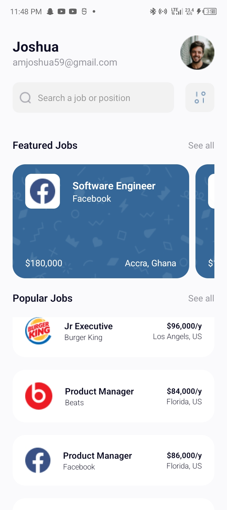
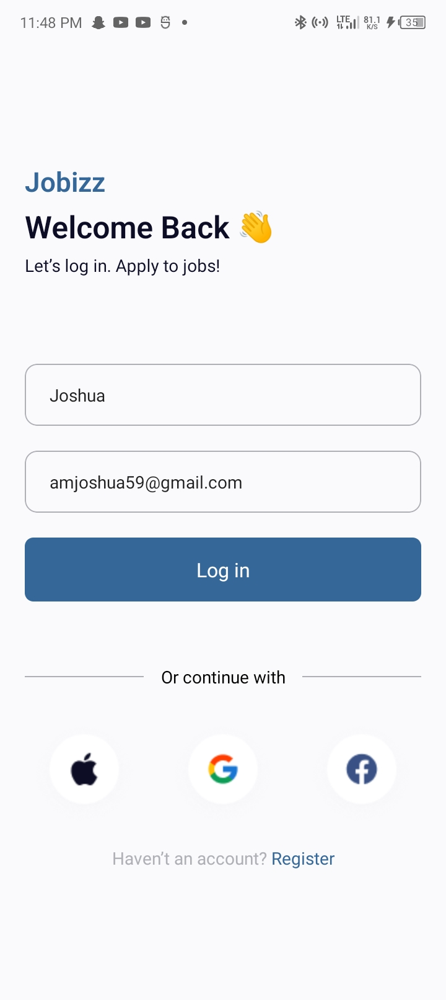

The app has 3 main components. They include:
### HomeScreen Component: 
This component contains the code for the home screen where the user is navigated to after they login.

### LoginScreen Component:
This component contains textinputs that allow the use to input their names and emails and login to the app where they are navigated to the home screen after a successful login

### UserContext Component: 
This component stores the user data that is the name and their email after the user logs in which any component in the app can make use of.

